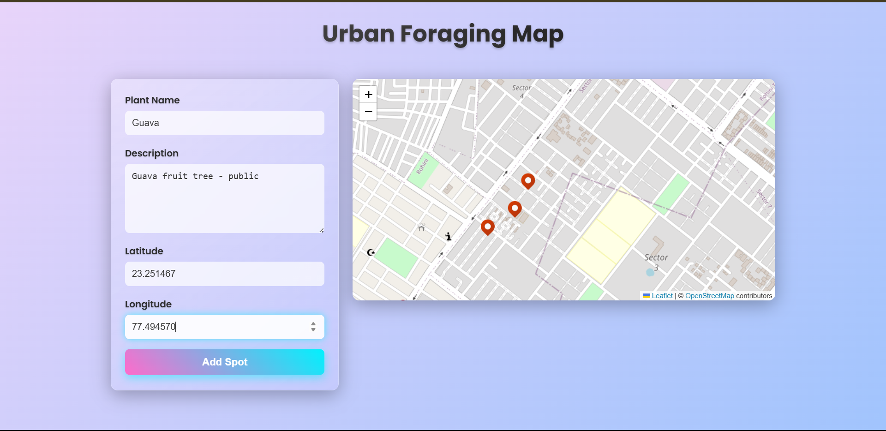
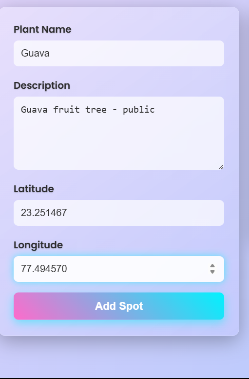
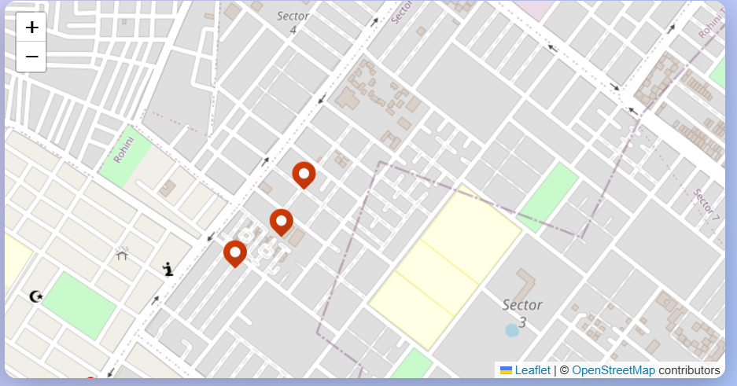
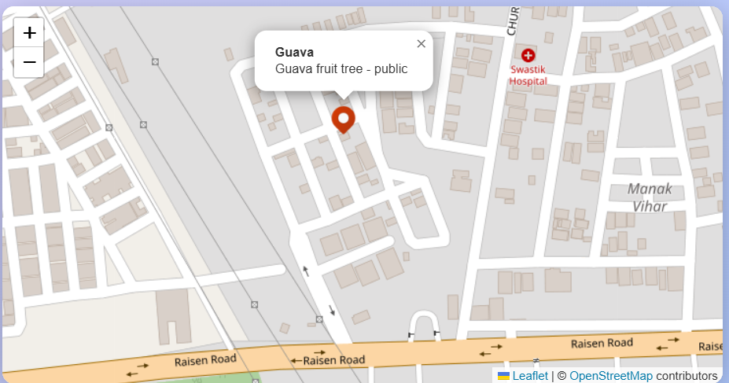

# Urban Foraging Map

Urban Foraging Map is a java full-stack web application that enables users to add and visualize urban foraging spots (e.g., fruit trees, edible plants) on an interactive map. Built with a **React** front-end and **Spring Boot** back-end, it features a Gen Z-inspired UI with vibrant gradients, glassmorphism, and animations. The app integrates a database, REST APIs, and external libraries, making it ideal for a college project submission.

## Features
- **Interactive Map**: Displays foraging spots with custom pins using Leaflet, with popups showing spot details.
- **Add Spots**: Form to add new spots (name, description, latitude, longitude) with real-time map updates.
- **REST APIs**: Back-end APIs for retrieving (`GET /api/spots`) and adding (`POST /api/spots`) spots.
- **Responsive UI**: Optimized for mobile and desktop with a modern, Gen Z aesthetic.
- **Database**: H2 in-memory database for storing spot data.

## Tech Stack
- **Front-end**: React, Leaflet, Axios, Normal CSS
- **Back-end**: Spring Boot, Spring Data JPA, H2 Database
- **Tools**: Maven, Node.js, Git

## Screenshots
| Description | Screenshot |
|-------------|------------|
| Full UI |  |
| Add Spot Form |  |
| Map with Pins (1) |  |
| Map with Pins (2) |  |

## Prerequisites
- **Node.js** (v20.x or later): [Download](https://nodejs.org/)
- **Java JDK** (17 or later): [Download](https://www.oracle.com/java/technologies/javase-jdk17-downloads.html)
- **Maven** (3.9.x or later): [Download](https://maven.apache.org/download.cgi)
- **Git**: [Download](https://git-scm.com/)
- A modern web browser (Chrome, Firefox, etc.).

## Setup and Installation
### 1. Clone the Repository
```bash
git clone https://github.com/<your-username>/UrbanForagingMap.git
cd UrbanForagingMap
```

### 2. Back-end Setup
1. Navigate to the back-end folder:
   ```bash
   cd backend/urbanforaging
   ```
2. Install Maven dependencies:
   ```bash
   mvn install
   ```
3. Run the Spring Boot application:
   ```bash
   mvn spring-boot:run
   ```
4. Verify:
   - Open `http://localhost:8080/api/spots` (returns JSON).
   - Access H2 console at `http://localhost:8080/h2-console`:
     - JDBC URL: `jdbc:h2:mem:testdb`
     - Username: `sa`
     - Password: (blank)

### 3. Front-end Setup
1. Navigate to the front-end folder:
   ```bash
   cd frontend/urban-foraging
   ```
2. Install Node.js dependencies:
   ```bash
   npm install
   ```
3. Start the React app:
   ```bash
   npm start
   ```
4. Open `http://localhost:3000` in a browser.

### 4. Test the Application
- **View Spots**: Map shows preloaded spots (e.g., Apple Tree, Berry Bush).
- **Add a Spot**:
  - Fill the form (e.g., Plant Name: "Mango Tree", Description: "Near park", Latitude: 28.7045, Longitude: 77.1030).
  - Submit to add (appears on map and database).
- **Database**: Check `SPOT` table in H2 console.

## Dependencies
### Back-end (`backend/urbanforaging/pom.xml`)
- Spring Boot Starter Web
- Spring Data JPA
- H2 Database
- Lombok
- Spring Boot DevTools

### Front-end (`frontend/urban-foraging/package.json`)
- React
- react-leaflet
- leaflet
- axios
- Node.js

### External Libraries
- Leaflet CSS: `https://unpkg.com/leaflet@1.9.4/dist/leaflet.css`
- Poppins Font: `https://fonts.googleapis.com/css2?family=Poppins`
- Custom Marker Icon: `https://img.icons8.com/fluency/48/000000/marker.png`

## Configurations
- **Back-end** (`backend/urbanforaging/src/main/resources/application.properties`):
  ```properties
  spring.datasource.url=jdbc:h2:mem:testdb
  spring.datasource.driverClassName=org.h2.Driver
  spring.datasource.username=sa
  spring.datasource.password=
  spring.jpa.database-platform=org.hibernate.dialect.H2Dialect
  spring.h2.console.enabled=true
  spring.jpa.hibernate.ddl-auto=update
  ```
  - CORS: Enabled in `SpotController.java` for `http://localhost:3000`.
- **Front-end**:
  - API endpoint: `http://localhost:8080/api/spots`.
  - Port: `3000` (configurable in `package.json`).

## Troubleshooting
- **Maven Error**:
  - Check `mvn -version` and `JAVA_HOME` (JDK 17).
  - Run `mvn clean install`.
- **Node.js Error**:
  - Delete `node_modules/` and `package-lock.json`, then `npm install`.
- **CORS Issue**:
  - Verify `@CrossOrigin("http://localhost:3000")` in `SpotController.java`.
- **Map Pins Issue**:
  - Check Console (F12) for icon load errors.
  - Confirm `leaflet.css` import in `index.css`.
- **Port Conflict**:
  - Update `package.json`:
    ```json
    "scripts": {
      "start": "react-scripts start --port 3001"
    }
    ```

## Demo
A Single Page Application (SPA) with:
- **Database**: H2 for spot storage.
- **APIs**: RESTful endpoints.
- **Libraries**: Leaflet, Axios, Poppins font.

See screenshots for UI and functionality.

## College Submission Notes
Meets requirements:
- **Database**: H2 (`SPOT` table).
- **APIs**: `GET/POST /api/spots`.
- **Libraries**: Leaflet, Axios, Poppins, Icons8.
- **Documentation**: README with setup, dependencies, screenshots.

## License
MIT License.

---
*Developed by Chandan Dehariya.*
